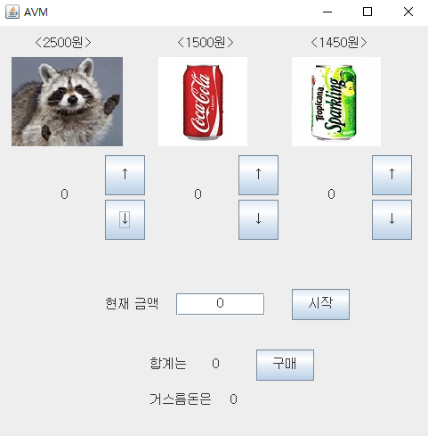
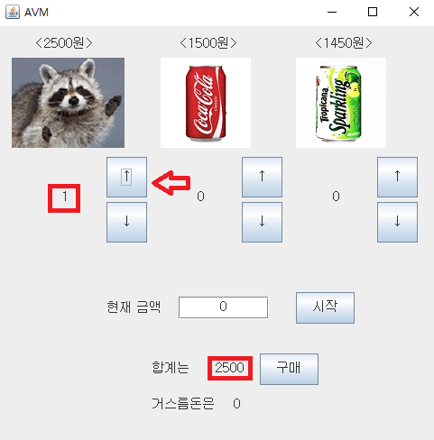
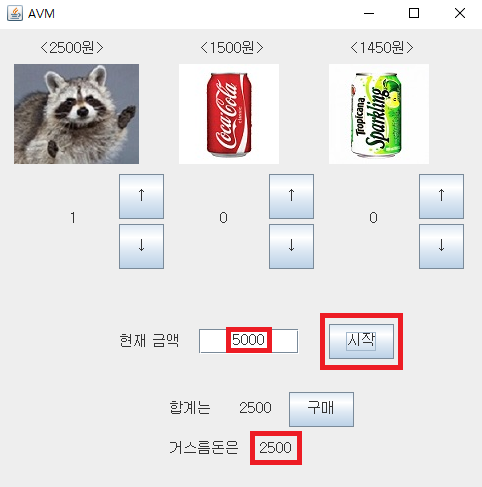
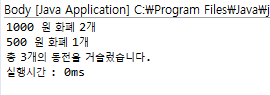

### 1. 프로그램 목적

본 프로그램은 인천대학교 컴퓨터 알고리즘 과제를 제출하기 위함이다.

### 2. 프로그램 설명

본 프로그램은 Java언어를 기반으로 작성되었으며, 그리디 알고리즘을 이용하여 작성한 거스름돈을 구하는 알고리즘을 자판기에 적용시킨 프로그램이다. 자판기의 인터페이스는 swing을 이용하여 작성되었다.

### 3. 프로그램 설치 및 사용법

본 프로그램은 Java언어를 기반으로 작성되었기 때문에 Java프로그램을 구동시킬 수 없는 환경에서는 실행이 불가능하다. 

Java프로그램을 구동시킬 수 있다면 저장소에 있는 PackageEx 폴더를 다운받고, src/AVM 폴더 밑에 Body.java를 실행시키면 된다.

아래는 실행 초기화면 이다.

화살표를 누르면 수량이 1늘어나고 합계에 2500원이 늘어난 것을 볼 수 있다.

현재 금액에 소유하고 있는 금액을 입력하고 '시작' 버튼을 누르면 거스름돈이 출력된다.

'구매'버튼을 누르면 거스름돈의 지폐와 동전 갯수 총합을 출력하고, 알고리즘이 계산하는 시간을 출력해준다.

### 4. 연락처

프로그램을 이용하다 버그가 발견되거나 문의사항이 있으면 hyoo9803@naver.com으로 연락바랍니다.

