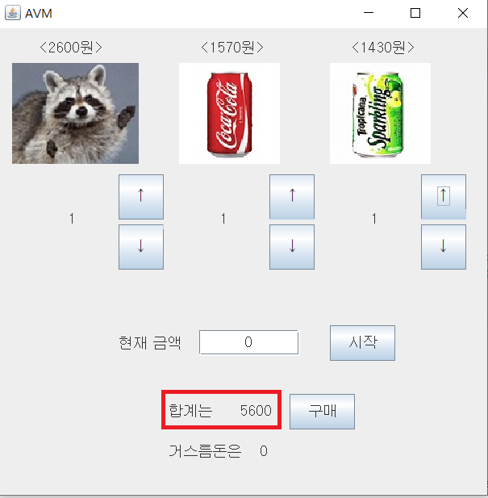
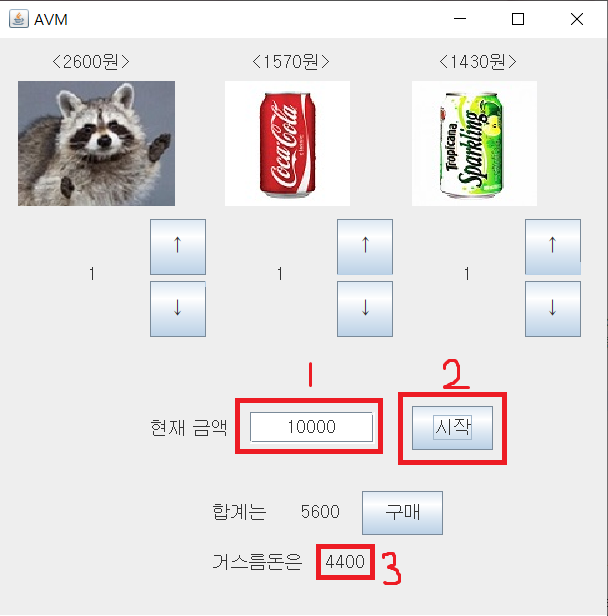
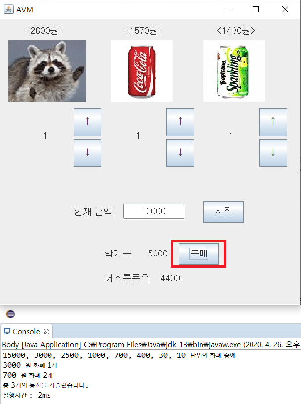
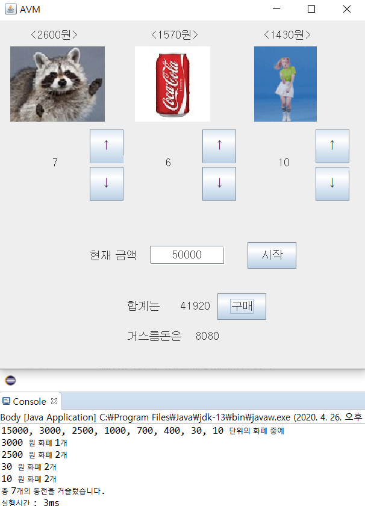
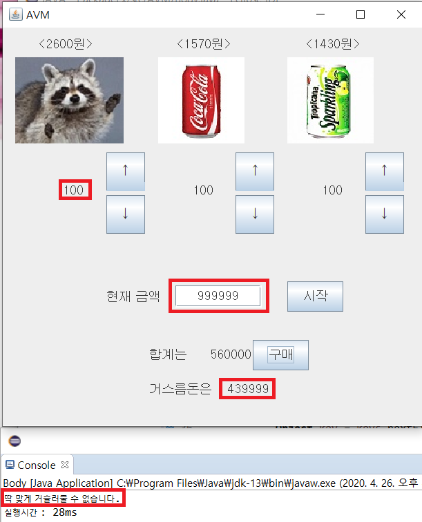

### 1. 프로그램 목적

본 프로그램은 인천대학교 컴퓨터 알고리즘 팀플 과제용으로 제작되었습니다.

### 2. 프로그램 설명

본 프로그램은 Java언어를 기반으로 작성되었으며, 그리디 알고리즘을 이용하여 작성한 거스름돈을 구하는 알고리즘을 자판기에 적용시킨 프로그램입니다. 자판기의 인터페이스는 swing을 이용하여 작성되었습니다.

<h3>
    3. 프로그램 코드 설명
</h3>

본 프로그램의 코드는 아래와 같이 구성되어 있으며, 핵심코드의 일부를 설명합니다.

* Greedy Algorithm
* Body
* Food

<h5>
    	3.1 Greedy Algorithm
</h5>

~~~java
class Algorithm {
	static int change;
	static void Greedy(int TotalPrice,int currentMoney) {
		change = currentMoney - TotalPrice;
        int[] coin = new int[]{2500, 3000, 700, 1000, 30, 10, 400, 15000};
        int[] temp = new int[1000001];
        int[] backtrack = new int[1000001];
        int[] num = new int[coin.length];

        Arrays.sort(coin);
        if(TotalPrice > currentMoney)
        {
            System.out.println("돈이 부족합니다.");
            return;
        }

        Arrays.fill(temp, 1000000000);
        Arrays.fill(backtrack, -1);
        temp[change] = 0;

        long starttime = System.currentTimeMillis();

        for (int c = coin.length-1; c >= 0; c--)
            for (int i = change; i >= coin[c]; i--)
            {
                if(temp[i - coin[c]] > temp[i]+1)
                {
                    temp[i-coin[c]] = temp[i]+1;
                    backtrack[i-coin[c]] = c;
                }
            }

        if(temp[0] == 1000000000)
            System.out.println("딱 맞게 거슬러줄 수 없습니다.");
        else
        {
            for(int i=num.length-1;i>=0;i--)
            {
                System.out.print(coin[i]);
                if(i!=0)
                    System.out.print(", ");
            }
            System.out.println(" 단위의 화폐 중에");

            int cur = 0;
            while(cur != change)
            {
                num[backtrack[cur]]++;
                cur+=coin[backtrack[cur]];
            }
            for(int i=num.length-1;i>=0;i--)
            {
                if(num[i] == 0)
                    continue;
                System.out.println(coin[i] + " 원 화폐 " + num[i] + "개");
            }
            System.out.println("총 " + temp[0] + "개의 동전을 거슬렀습니다.");
        }

        long endtime = System.currentTimeMillis();
        long runtime = endtime - starttime;

        System.out.println("실행시간 : " + runtime + "ms");
    }
}
~~~

위 코드는 그리디 알고리즘을 적용하여 거스름돈을 반환할 때, 최소의 동전 갯수를 리턴합니다. 또한 sort를 통하여 화폐의 단위들을 정리하지 않더라도 사용이 가능합니다.

<h5>
    3.2 Body
</h5>

~~~java
	static JButton btn1,btn2;
	static JLabel imgLbl1,imgLbl2,imgLbl3;
	static JTextField field;
	static Food food[] = new Food[3];
	static int currentMoeny,TotalPrice=0;
	static final int MaxSize=100;
	static String ReturnMoney;
~~~

Body는 Swing을 통한 GUI구성에 필요한 버튼과 음식리스트, 금액에 관한 변수들을 담았습니다. 

~~~java
btn1.addActionListener(event->{
			if(food[0].size>0) {
			food[0].size--;
			TotalPrice-=food[0].price;
			if(food[0].size==10) Body.imgLbl1.setIcon(HumanNG);
			else Body.imgLbl1.setIcon(NGIMg);
			foodSize[0]= Integer.toString(food[0].size);
			lbl.setText(foodSize[0]);
			
			FoodSum[0]=Integer.toString(TotalPrice);
			lblSumNum.setText(FoodSum[0]);
			}
		});
~~~

또한 위와 같이 버튼을 누를 경우 금액계산을 하도록 코드를 구성하였습니다.

<h5>
    3.3 Food
</h5>

Food는 음식의 정보들을 담고있는 생성자로 구성하였습니다.

~~~java
class Food {
	String name;
	int price;
	int size;

	public Food(String name,int size,int price) {
		this.name=name;
		this.price=price;
		this.size=size;
	}
}
~~~

### 4. 프로그램 설치 및 사용법

본 프로그램은 Java언어를 기반으로 작성되었기 때문에 Java프로그램을 구동시킬 수 없는 환경에서는 실행이 불가능합니다. 

Java프로그램을 구동시킬 수 있다면 저장소에 있는 PackageEx 폴더를 다운받고, src/AVM 폴더 밑에 Body.java를 실행시키면 됩니다.

아래는 실행 초기화면입니다.

화살표를 누르면 수량이 1씩 증가/감소하고, 숫자가 기록됩니다.

합계에 총 5600원이 늘어난 것을 볼 수 있습니다.

현재 금액에 소유하고 있는 금액을 입력하고 '시작' 버튼을 누르면 거스름돈이 출력됩니다.

'구매' 버튼을 누르면 거스름돈의 지폐와 동전 개수 총합을 출력하고, 알고리즘이 계산하는 시간을 출력해줍니다.

거스름돈 금액이 올라간 경우, 실행시간이 약간 늘어났음을 확인할 수 있습니다.

시간복잡도가 (화폐 종류의 수 * 거스름돈 액수) 정도의 복잡도를 가지기 때문입니다.

~~(구매 수량이 10개인 경우 이스터에그도 추가했습니다!)~~

거스름돈이 주어진 화폐 단위로는 딱 맞게 거슬러줄 수 없는 경우입니다.

(위의 경우처럼, 거스름돈 액수가 늘어나서 실행시간이 더 오래걸렸음을 확인할 수 있습니다.)

또한 알고리즘의 공간복잡도(메모리 사용량) 가 거스름돈 액수와 같고, 100만으로 설정해두었으므로 100만을 넘지 않아야합니다.

### 5. 연락처

프로그램을 이용하다 버그가 발견되거나 문의사항이 있으면 hyoo9803@naver.com으로 연락바랍니다.

